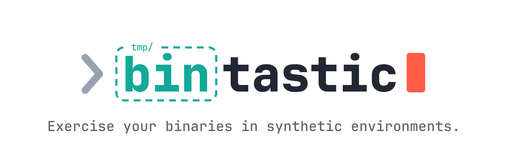

<p align="center">
  <picture>
    <source media="(prefers-color-scheme: dark)" srcset="./docs/public/bintastic-banner-dark.png" />
    
  </picture>

<p align="center">
  
  <a href="https://badge.fury.io/js/bintastic">
    
  </a>
  <a href="https://github.com/scalvert/bintastic/blob/master/package.json">
    
  </a>
</p>

</p>

> **Note:** This package was formerly published as `@scalvert/bin-tester`.

Testing a CLI isn't like testing a library—you can't just import functions and call them. You need to spawn your CLI as a subprocess, give it real files to work with, and capture its output. `bintastic` simplifies this:

```ts snippet=basic-example.ts
import { createBintastic } from 'bintastic';

describe('my-cli', () => {
  const { setupProject, teardownProject, runBin } = createBintastic({
    importMeta: import.meta,
    binPath: './bin/my-cli.js', // resolved relative to this test module
  });

  let project;

  beforeEach(async () => {
    project = await setupProject();
  });

  afterEach(() => {
    teardownProject();
  });

  test('processes files', async () => {
    await project.write({ 'input.txt': 'hello' });

    const result = await runBin('input.txt');

    expect(result.exitCode).toBe(0);
    expect(result.stdout).toContain('processed');
  });
});
```

## Install

```bash
npm add bintastic --save-dev
```

## Documentation

Full documentation lives at **[scalvert.github.io/bintastic](https://scalvert.github.io/bintastic/)**:

- **[Getting Started](https://scalvert.github.io/bintastic/guide/getting-started)** — what bintastic is and the quick-start example
- **[Usage](https://scalvert.github.io/bintastic/guide/usage)** — `createBintastic` options, `binPath` resolution, writing fixture files, and reading results
- **[Debugging](https://scalvert.github.io/bintastic/guide/debugging)** — `BINTASTIC_DEBUG` modes, `runBinDebug`, and the VS Code launch configuration
- **[API Reference](https://scalvert.github.io/bintastic/api/)** — generated type documentation
